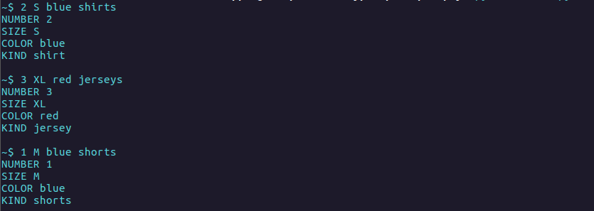
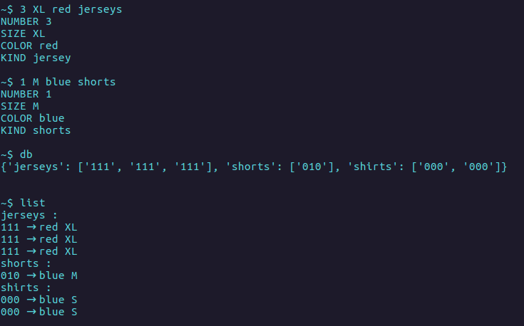

# IS-Lexer-Parser-Gramma
Lexical and syntax gramma analysis app in example of wholesaler of sports clothing. Created at the University as the project within Intelligent Systems classes in 2016. The purpose of this project was to learn lexical and syntax gramma in PLY (Python Lex-Yacc).

## App
The football club orders from the wholesaler sports clothes for the club changing room. Order refers to a T-shirt, match shirts and shorts in different sizes and also in two different colors: blue and red. The program is designed to collect a full order as a compilation of various variants. This application is an example of show the scheme of building the program in PLY. App uses polish language. For see full details go to [documents](documents).

### Screenshots
Screenshots examples of orders and clothes states.

  

## PLY
PLY is a Python language library that allows to build parsers and compilers. PLY is based on the well-known Lex and Yacc libraries for language C - however, it is implemented from scratch in Python. PLY Library divided into two components LEX and YACC. 

### LEX
LEX serves for lexical analysis. With the help of LEX, a set of tokens of language and expressions regular is build. Selected tokens are extended by functions.

### YACC
YACC serves for syntactic analysis. With the help of YACC, sets of rules for language is build, the order can be determine and also rules can be extended with additional logic.

## Issues
In the processing of natural language the programmer has the task of deriving computer rules so that I can analyze, translate or generate a natural language understandable to a human being. The essence of this issue is usually issuing ordinary commands to computer in natural language.

## Gramma
Grammar is a method that describes acceptable sequences of words
to the lexicon.

### Lexicon
{trzy, troje, siedem, jedna, chlopcow, druzyny, pilek, pilka malych, duze, wielka, niebieska, owalna}

### Examples of acceptable sequences
- trzy duze druzyny
- troje malych chlopcow
- siedem malych pilek
- jedna wielka niebieska owalna piłka

### Examples of unacceptable sequences
- trzy
- troje chlopcow malych
- siedem malych duzych pilek
- jedna wielka pilek

## Formal gramma
Grammar is a set of rules for text strings in formal language. Rules describe how to create text strings from the language alphabet in such a way that they are consistent with the language syntax. Grammar does not describe meaning string of text, but only its form.

### Formula
G = <N, V, P, S>
N - collection of non-terminal symbols (auxiliary symbols)
V - set of terminal symbols (lexicon words)
P - collection of language production (grammar rules)
S - start symbol (one of the non-terminal symbols)

### Gramma example
Grammar G = <N, V, P, S>
- Collection of non-terminal symbols N = {cmd, art, color, size, number, shape, kind}
- Collection of terminal symbols V = {trzy, troje, siedem, chlopcow, druzyny, pilek, pilka, malych, duze,wielka, niebieska, owalna}
- Starting symbol S = cmd
- The collection of language production P =  
{  
	cmd: (number, art),  
	art: (size, color, shape, kind),  
	number: ("trzy", "troje", "jedna", "siedem"),  
	size: ("malych", "duze", "wielka"),  
	color: ("niebieska"),  
	shape: ("owalna"),  
	kind: ("chlopcow", "druzyny", "pilek", "pilka")  
}

## Lexical analysis
Lexical analysis consists in dividing the text into tokens, and then assigning each of them from the lexicon. The program that performs this analysis it is called lexer (e.g.: LEX).

### Lexical analysis examples
IN: troje malych chlopcow  
OUT: troje: NUMBER, malych: SIZE, chlopcow: KIND  
  
IN: jedna wielka niebieska owalna pilka  
OUT: jedna: NUMBER, wielka: SIZE, niebieska: COLOR, owalna: SHAPE, pilka: KIND  

## Syntax analysis
The syntax analysis checks whether the input meets the grammar rules. In case of correctness, may return the series of actions taken. The program that this analysis is called a parser (eg: YACC).

### Syntax analysis examples
IN: jedna:SIZE owalna:SHAPE niebieska:COLOR wielka:SIZE pilka:KIND  
OUT: Failure  
  
IN: jedna:NUMBER wielka:SIZE niebieska:COLOR owalna:SHAPE pilka:KIND
OUT: Success. Action: Save into local database. Action: Send data to server.
